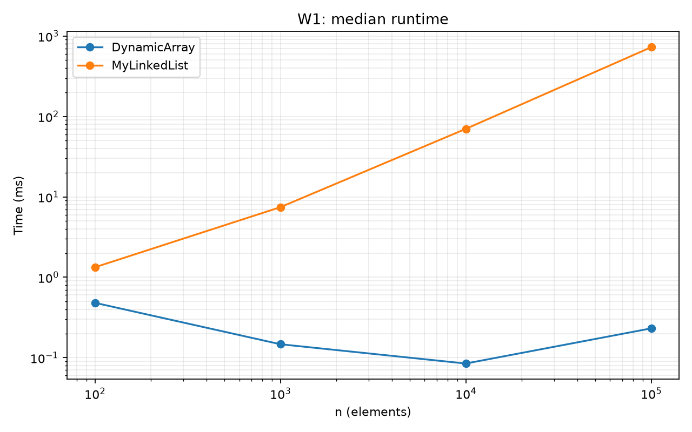
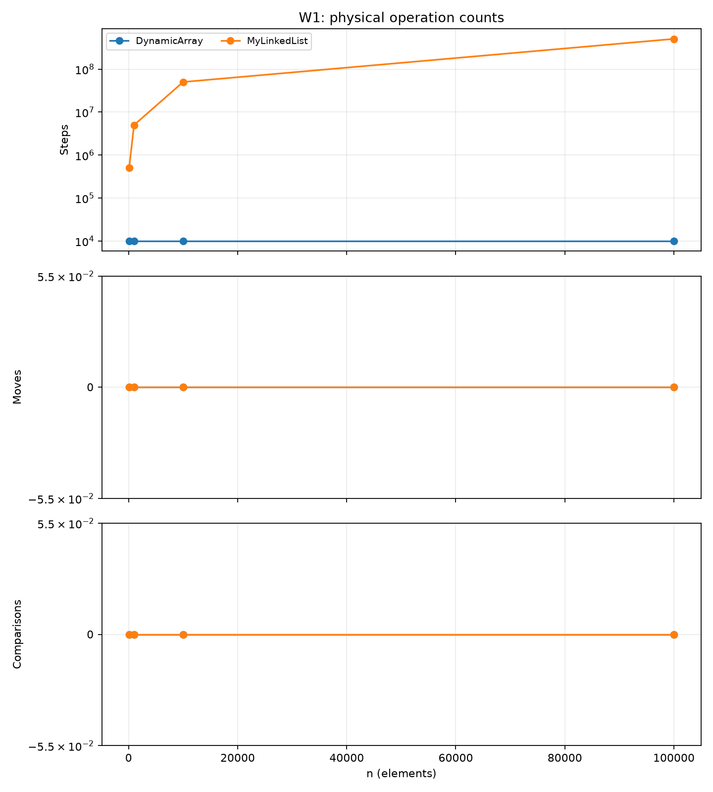
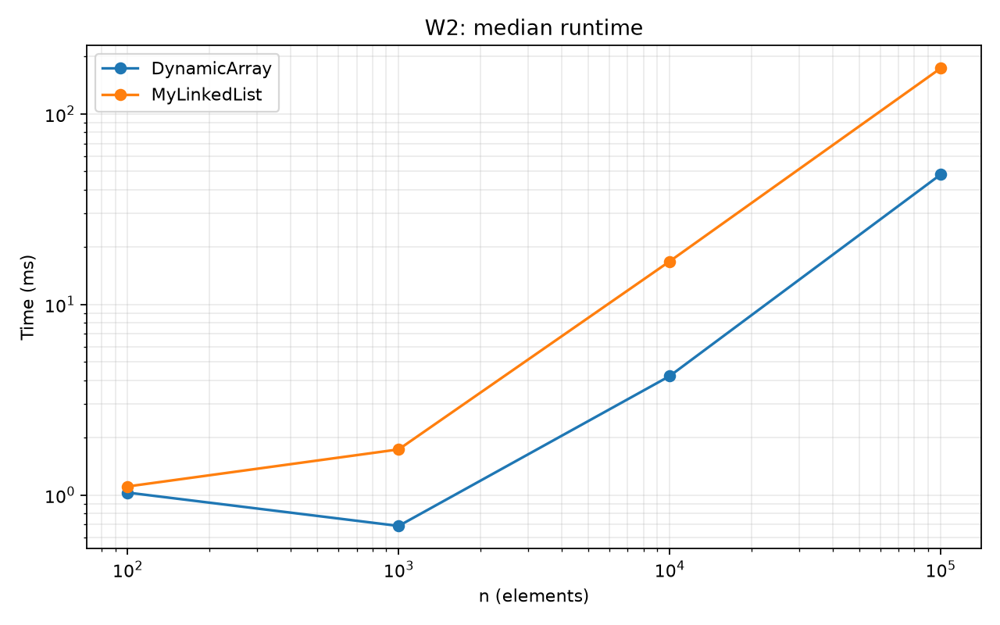
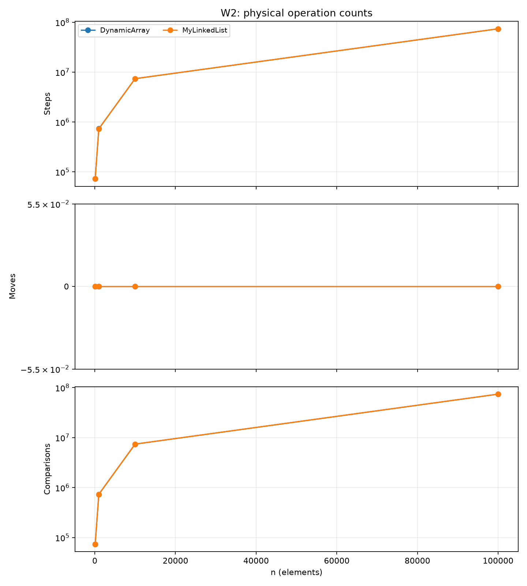
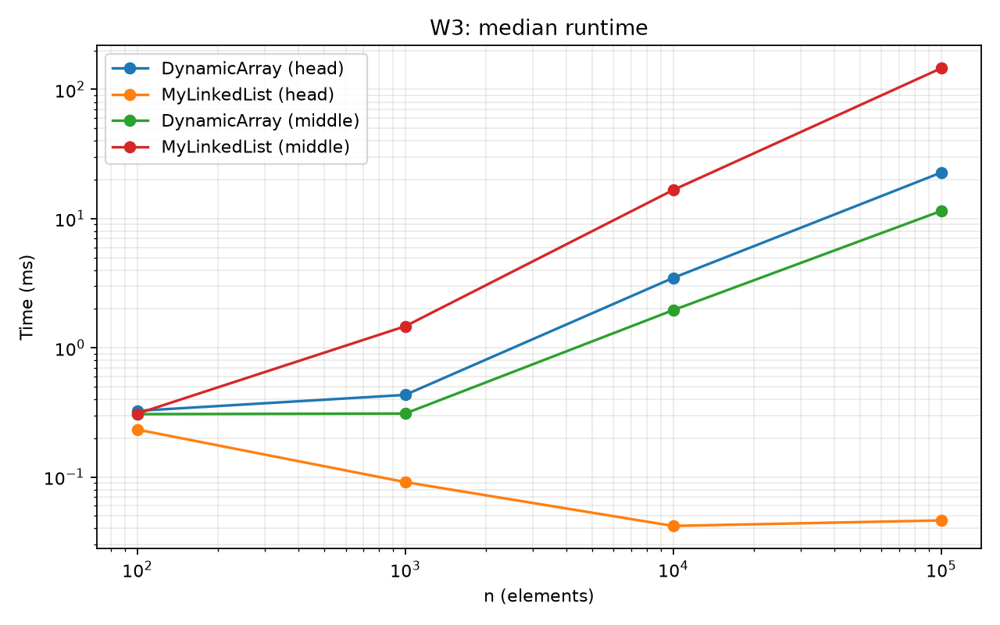
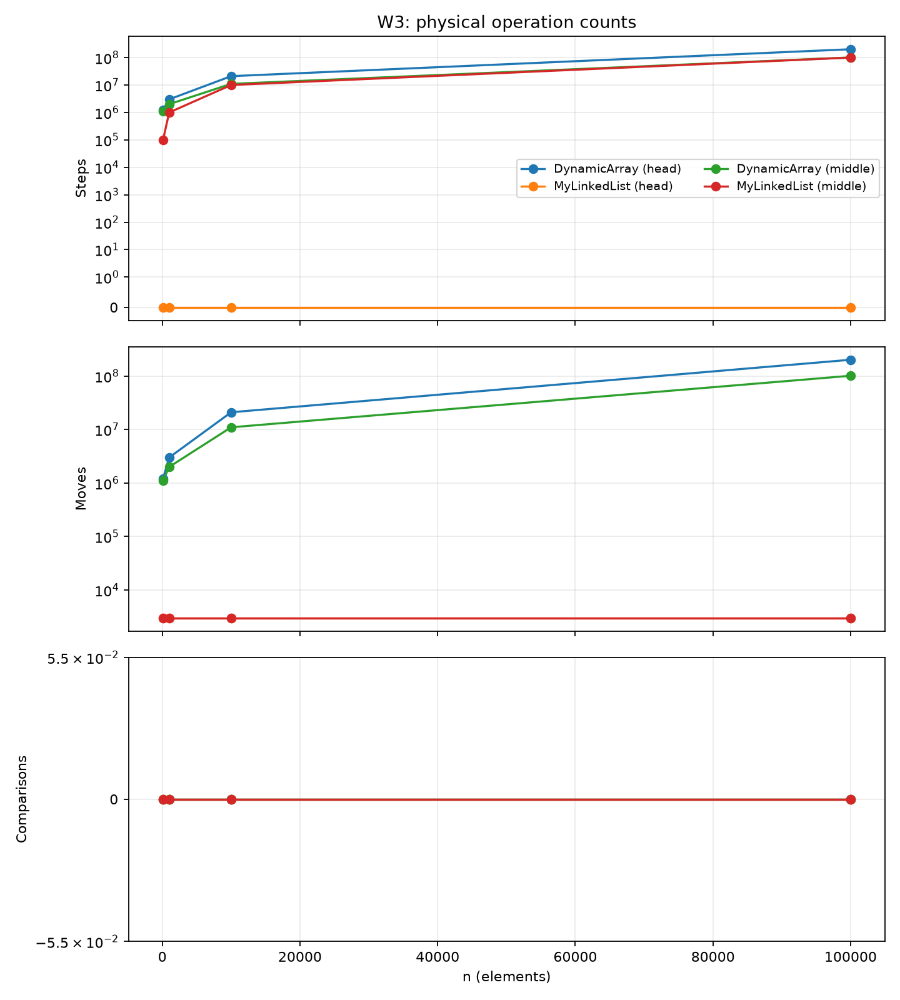
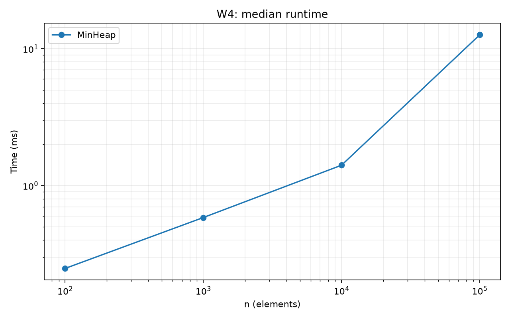
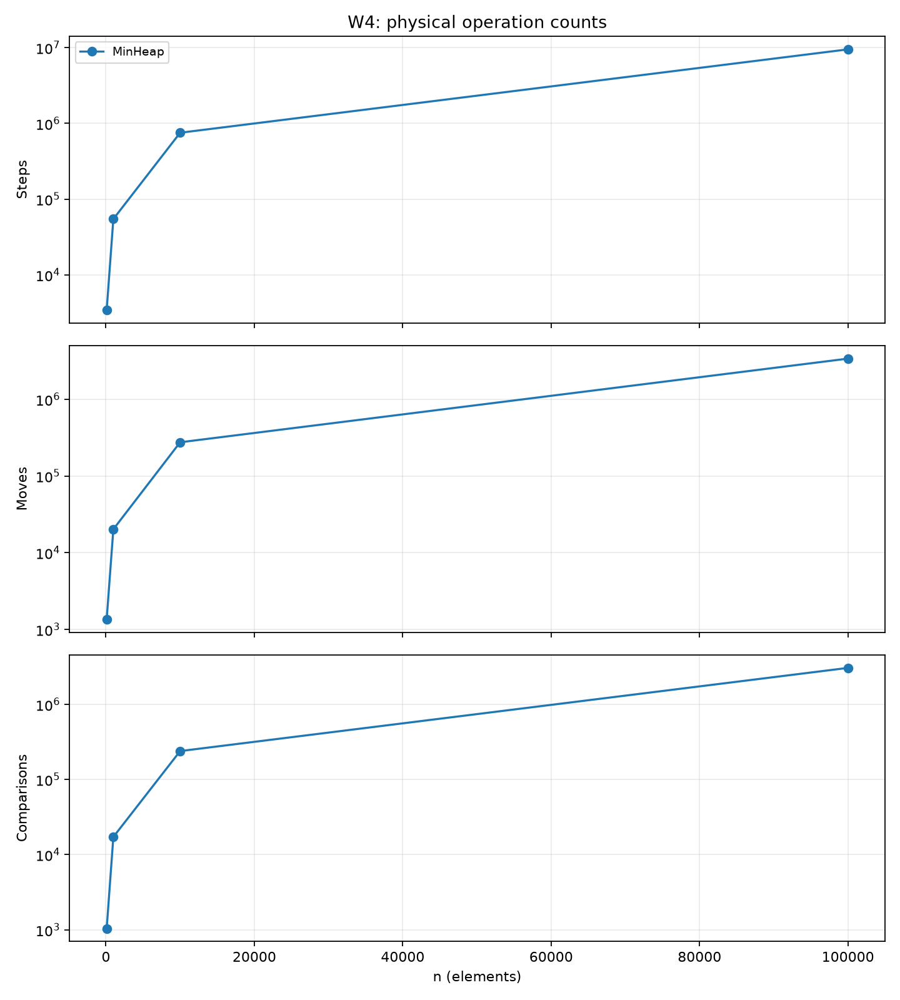

# Assignment 2

## Setup

The project uses `int` values in a dynamic array, a linked list, and a min-heap. The benchmark uses `Random(42)`, four sizes from 100 to 100,000, one warm-up, and five measured runs. It saves median time and operation counts to `results/results.csv`. W1–W3 setup is outside the timed part; W4 includes heap inserts and removals. This run used OpenJDK 26 on Linux.

## Complexity

| Structure / operation | Best | Average | Worst | Extra space | Reason |
|---|---:|---:|---:|---:|---|
| DynamicArray `add(x)` | Θ(1) | Θ(1)* | Θ(n) | O(n) on resize | A full array is copied; doubling makes most appends cheap. |
| DynamicArray `add(i,x)` | Θ(1) | Θ(n) | Θ(n) | O(1), plus resize | End insert needs no shift; other inserts shift values. |
| DynamicArray `remove(i)` | Θ(1) | Θ(n) | Θ(n) | O(1) | Removing the last value needs no shift. |
| DynamicArray `get(i)` | Θ(1) | Θ(1) | Θ(1) | O(1) | The index reads one array cell. |
| DynamicArray `contains(x)` | Θ(1) | Θ(n) | Θ(n) | O(1) | The search may check every value. |
| MyLinkedList `add(x)` | Θ(1) | Θ(1) | Θ(1) | Θ(1) new node | The tail gives direct access to the end. |
| MyLinkedList `add(i,x)` | Θ(1) | Θ(n) | Θ(n) | Θ(1) new node | Other positions need a walk through the list. |
| MyLinkedList `remove(i)` | Θ(1) | Θ(n) | Θ(n) | O(1) | The list must find the previous node. |
| MyLinkedList `get(i)` | Θ(1) | Θ(n) | Θ(n) | O(1) | The list follows links from the head. |
| MyLinkedList `contains(x)` | Θ(1) | Θ(n) | Θ(n) | O(1) | The search may check every node. |
| MinHeap `insert(x)` | Θ(1) | Θ(log n) | Θ(n) | O(n) on resize | The value moves up; a full array must be copied. |
| MinHeap `peekMin()` | Θ(1) | Θ(1) | Θ(1) | O(1) | The minimum is at the root. |
| MinHeap `extractMin()` | Θ(1) | Θ(log n) | Θ(log n) | O(1) | The last value may move down one tree path. |

| Workload | Time | Operation counts |
|---|---|---|
| W1 — Random access |  |  |
| W2 — Search |  |  |
| W3 — Insert and remove |  |  |
| W4 — Priority processing |  |  |